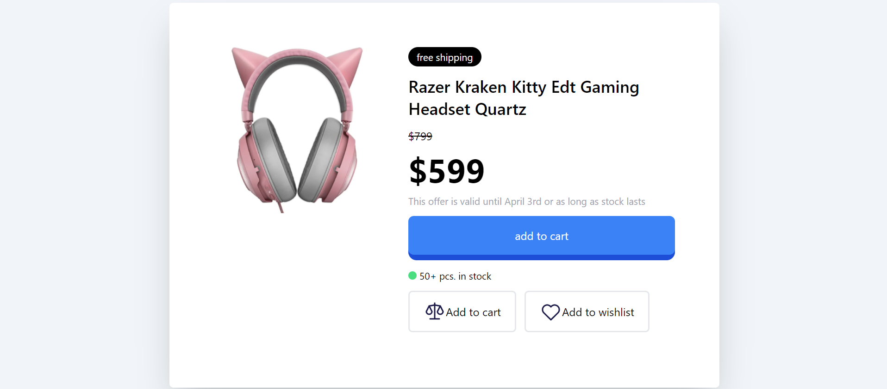

<html>
<head>
    <meta charset="UTF-8">
    <meta name="viewport" content="width=device-width, initial-scale=1.0">
</head>
<body>
    

    <h1 class="font-serif border border-grey-500 h-10 w-40 text-2xl font-medium text-center text-white">Final Preview</h1>
    

</body>
</html>